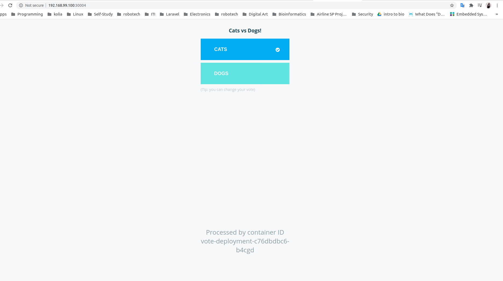
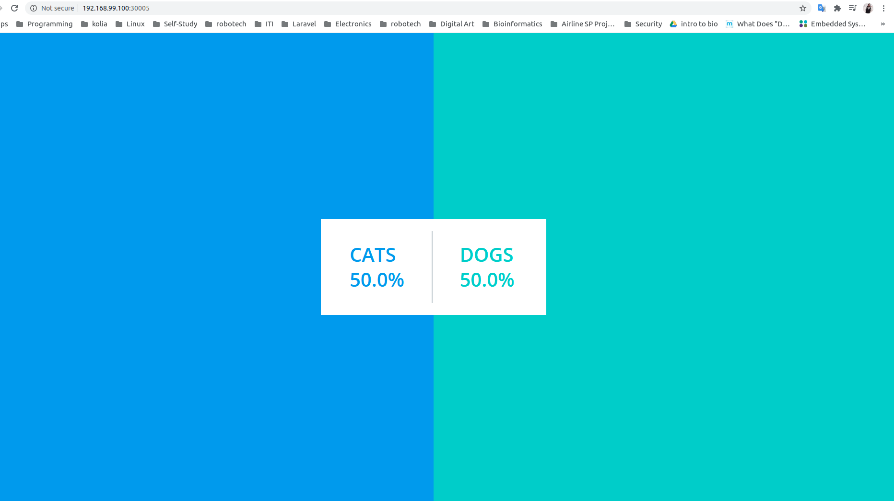

# Deploying Simple Voting Application Stack With Kubernetes

## Architecture


## How to use:


1- Start minikube:

```
$ minikube start driver=<driverName>
```

2- Create services:

```
$ kubectl create -f services/
```

3- Create deployments:

```
$ kubectl create -f deployments/
```

4- Get the url of the voting-app:

```
$ minikube service vote-service --url
```




5- Get the url of the result-app:

```
$ minikube service result-service --url
```

